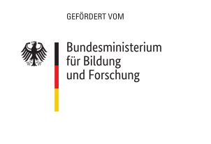

# 🗃 Mapper

Main database interface.

See general documentation on [tech.feminizidmap.org/docs/mapper/](https://tech.feminizidmap.org/docs/mapper/) (wip).

## Development setup

See respective directories for more information on a development setup

- [backend](/backend)
- [frontend](/frontend)

## Production deployment

Create a copy of env.sample

`$ cp env.sample .env`

and change values accordingly. Then fire up docker-compose

`$ docker-compose up -d`

## Sponsorship

