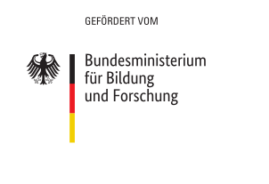

# Feminizid-Mapper

Main database interface.

## Development setup

* Ruby version

3.0.0

* System dependencies

    - Postgresql

    - Redis

* Configuration

Copy and adjust the env.sample and source it

``` bash
$ cp env.sample .env && source .env
```

* Database creation

* Database initialization

* How to run the test suite

* Services (job queues, cache servers, search engines, etc.)

* Deployment instructions

* ...


## Sponsorship

[](https://www.bmbf.de/)
[](https://prototypefund.de/)
